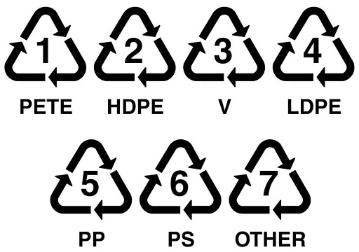
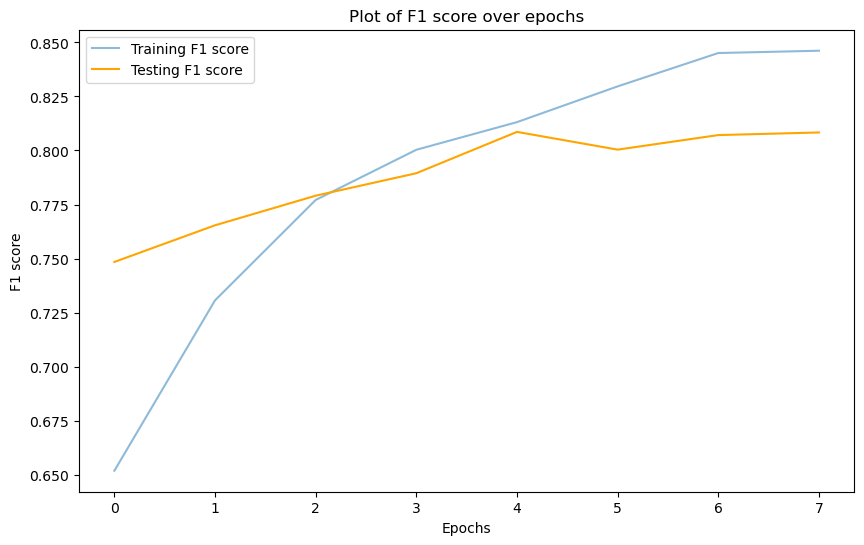
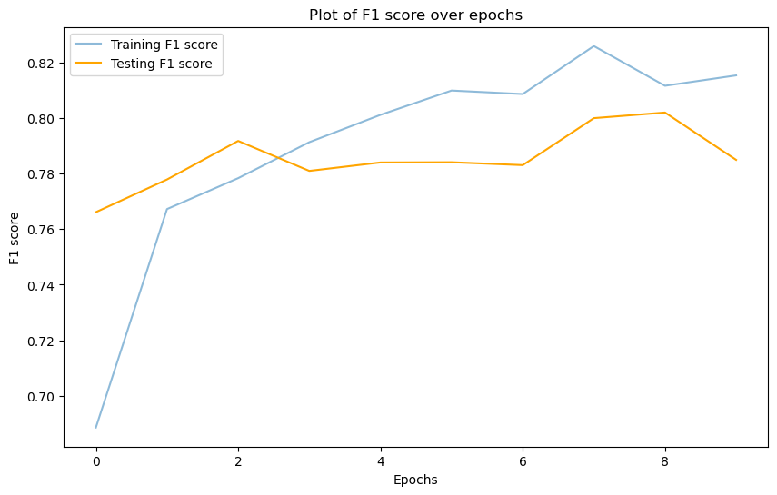

# Capstone Project : Classifying plastic resins codes for recycling

## Background

Singapore's [National Recycling Programme](https://www.nea.gov.sg/our-services/waste-management/3r-programmes-and-resources/national-recycling-programme) that was launched back in 2001 making available recycling collection services in thr form of blue bins to the public in HDB estates as well as private properties (landed and apartment/condomimums alike).

Under the [Sustainable Singapore Blueprint](https://www.straitstimes.com/multimedia/graphics/2022/04/recycle-me-not/index.html), Singapore wants to improve the domestic recycling rate to 30 per cent by 2030.  Howver, according to the [nea recycling statistics](https://www.nea.gov.sg/our-services/waste-management/waste-statistics-and-overall-recycling) the total amount of waste generated increased from 6.94 to 7.39 million tons in 2022. Of this 7.39 million tones, the plastics waste stream accounted for 1.001 million tonnes. Only 57,000 tonnes were recycled, a mere 6%. In fact, the [domestic recycling rate in Singapore in 2022 was the lowest recycling rate in more than a decade](https://www.straitstimes.com/singapore/domestic-recycling-rate-in-singapore-lowest-in-over-a-decade), dropping 12 percent from the previous year. While the breakdown is not specified for domestic, it can be inferred that plastic recycling rates is around the forementioned 6%. 

Blueprints, campaigns, and programmes aside, it is equally important to delve into the materials itself when recycling is mentioned. Plastic Identification Codes (or more accurately, Resin identification code) are commonly found marked on the plastic materials to facilitate the identification of the plastic type for recycling. Example below.

 

The purpose for labelling the different types of plastic is due to the different properties of each plastic resin at the molecular level. A clear difference would be the different temperatures that the resins melt at, in other words not all plastics are the same. 

Under the [Basel Convention](https://www.nea.gov.sg/corporate-functions/resources/legislation-international-law/multilateral-environmental-agreements/chemical-safety/basel-convention) the threshold limit of contamination of single stream plastic waste is < 0.5%. This is of significance since local materials recovery facility export the materials to overseas facilities for further processing. Thefore, the purity of the various plastic resins being recycled would impact the ability to export for processing as well as the final purity of the regenerated plastic raw material for use/sale. 

On top of this or in part due to the above reasons, it is important point to note that in Singapore [not all plastics are recyclable.](https://plasticlite.sg/) Only Resin identification code 1 (PET), 2 (HDPE), 4 (LDPE) and 5 (PP) are recyclable. The rest of the codes 3 (PVC), 6 (PS), and 7 (Others) are not recycled.

## Problem Statement

With the above background, it becomes apparent that recycling is not a straightforward process. Just plastics alone have 7 associated resin codes/symbols of which 4 are recycle and 3 are not. Other than these 7 symbols, these are not the only symbols out there relating to recycling and on top of it, there are other markings on the plastic that may look similar but representing other unrelated information.

Therefore it can be said that in order to recycle effectively, there is a necessary knowledge that an individual requires in order to identify and sort their waste material for recycling. This may be discouraging for the layperson, affecting their recycling habits or their recycling attempts when the plastics they put in the effort to segregate and clean before recycling are wasted since it is not recycled in Singapore.

In order to continue nudging Singapore towards 30% recycling rate by 2030, NEA is exploring new ways to encouraging Singapore to recycle on top of existing campaigns and posters. A team in NEA's Information Technology Division has been tasked with developing a proof-of-concept project.

>The purpose of such a project is to determine if it there is a feasible way to assist the general public in their recycling activities in particular, determining which plastics are recyclable. Utilising computer vision in a binary classification model a plastic material can be classified as recyclable or not by recognising the Resin Identification markings on the plastic material, thereby reducing the confusion and knowledge requirement for the layperson to recycle effectively. The scoring metric used in classification is F1 score with a 80% being used as a threshold of success for the project to be considered feasible.

With a good cv model to classify the various plastic resin symbols as recyclable or not, the layperson will be better equipped to recycle plastics appropriately without having to continually refresh their knowledge in order identify the plastic resin recyclability. If such a classification by a cv model is possible, this project can then be further developed to encompass other recyclables classes for deployment under the NEA banner to the general publics as part of their campaigns to encourage recycling.

## Data

A data set has been obtained online at [kaggle](https://www.kaggle.com/datasets/piaoya/plastic-recycling-codes) and it has been fund to have segregated data into 7 types of plastics as well as a last class of non-plastic symbols and other random images. For this project, the non-plastic class will be ignored. Additional images manually scraped online as well as personally taken images are added into the mix as well. 

Due to the sparseness class imbalance in the data, offline Data Augmentation of individual class output using albumentations was done on the images and it is stored in an output within each class. This data is available [here.](https://drive.google.com/drive/folders/1OxjUhOn18cQlbEgY32rJupDMnO-MIxkp?usp=sharing) A dulplicate folder with all the 7 classes collapsed as binary class of recyclables and non recyclables is available as well.

Due to the underlying unevenness, both in terms of images within the 7 resin codes as well as in the binary from (recyclable class has 4 subclass mixed within while non-recyclables has 3 subclass mixed within), F1 score is used as a balance between the Positive Prediction rate and the True positive rate which accounts the true positives amongst the false negatives and false positives respectively.

## Modelling
Due to the low quantity of images, training from scratch would not be feasible due to generasability concerns, Hence any models developed would have to use transfer learning in the from of existing network architectures to develop the desired use case.

Three pretrained models are selected to be used for modelling exploration MobileNet, EfficientNet and ResNet.

1. MobileNetV2 will be first explored since the targeted platforms are likely of mobiles or those with lighter computing power. MobileNetV3 will be explored as well since in the [MobilenetV3 paper](https://arxiv.org/pdf/1905.02244.pdf) the next version MobileNetV3-Large and MobileNetV3-Small has some improvements in accuracy and has lower latency so some improvements gains could be had.

2. EfficientNetV2M will be explored since it is utilises [Neural Architecture Search and model scaling](https://wisdomml.in/efficientnet-and-its-performance-comparison-with-other-transfer-learning-networks/#What_is_EfficientNet) to optimise the network and hence could show greater promise in improving the scores. While this comes at the expense of computational speed. and deployment size, a model with better scores would be more functional and hence prioritised.

3. ResNet will be explored as last in the hopes that the earlier models would have already higher scores and the ResNet models would be the architecture to see if a deeper learning network that seeks to minimise residuals for errors can lead to even more gains in the model scores to see what can be achieved.

## Results

|  No.  |   Index   | Model                         | epoch |     loss     |  f1_score |  val_loss | val_f1_score | Overfit % |
|:-----:|:---------:|-------------------------------|:-----:|:------------:|:---------:|:---------:|:------------:|:---------:|
| **1** | **3.4.3** | **EfficientNetV2M + dropout** | **9** | **0.458298** | **81.2%** | **50.3%** |   **80.2%**  |  **1.0%** |
|  _2_  |  _3.3.3_  | _MobileNetV3 + dropout_       |  _5_  |  _0.450005_  |  _81.3%_  |  _50.7%_  |    _80.9%_   |   _0.5%_  |

The top 2 results of which meet the score criteria set out in the problem statemment is presented in the table above and the F1 Score curves are presented below.

  
   

Comparing the F1 curves of models 1 (left/top) and 2, both are similar with the difference being that model 2 has a constantly increasing Train score and has shorter number of epochs before earlystopping kicked in while model has more more progress in improving over more epochs before early stopping kicked in.

Since model 1 utilised EfficientNet architecture while model 2 used Mobilenet architecture, it can be intuited that the EfficientNet architecture having optimising components in the higher number of parameters is working. Thiis hould give it a slightly more generalisable model and hence may give better performance for predicting. 

Since the overarching intention is to have better prediction probabilities, the more generalisable model would be preferred so Model 2 will be used. Should there be other considerations or requirements, it can be revisited.

Some test images can be found [here](https://drive.google.com/drive/folders/1CQC76J57FzFVd_bUq6eb1vKATUaJswdw?usp=sharing)
