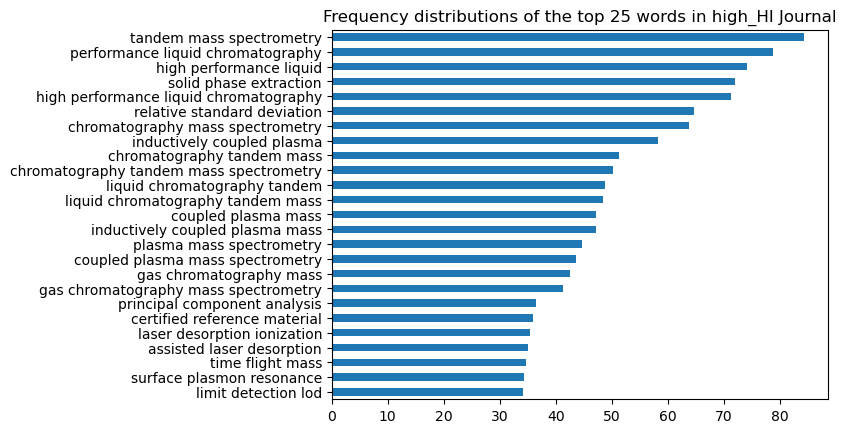

#  Project 3: Classifying scientific journals

## Background
In the current fast paced society, it is increasingly costly and pressurising to do research and to advance. [“As grants become increasingly selective, scientists must spend more time writing proposals, leading to ‘crippling demands’ that subtract time from thinking, reading, and conducting research.”](https://siepr.stanford.edu/publications/policy-brief/race-bottom-how-competition-publish-first-can-hurt-scientific-quality) Thus, researchers are in a high-pressure situation to be published in order to increase their reputation and hence increase their chances of securing funds since being published in a journal associates associates the researcher's reputation via the paper with the journal’s reputation and vice versa.

With anyand every paper produced by a researcher, there are two goals to be accomplished. 
1) Get through the first round of being accepted for peer-review be accepted ostensibly or for peer review.
2) Get published so in a journal with the highest repute possible.

A point to note, scientific peer-reviewed journals themselves have a distinct reputation and scoring/indexing system. The H-Index (HI) value is one such system. It represents the number of papers (h) published in a journal that have been cited at least h times. This quantifies both productivity (i.e. number of papers produced) and impact (number of citations) in a single number, sort of an average of a journals repute.
In this light, this project aims to investigate if there is a difference between papers published in two journals of differing reputation (HI), specifically the abstract which functions like the executive summary of a project like this very one. Natural Language Processing (NLP) would be used to train a classifier on which journal the papers’ abstracts came from, (‘high_HI’ and ‘low_HI’). This would then allow the exploration of the keywords that is distinct to the high_HI journal that would allow researchers to craft their abstract in a more targeted manner to improve their chance of acceptance by publishers of said journal.  

## Approach in brief

Journal used in acquiring data

| Label   | Journal Name                           | H-Index | Impact factor | Link                                                                                                                                            |
|---------|----------------------------------------|---------|---------------|-------------------------------------------------------------------------------------------------------------------------------------------------|
| low_HI  | Journal of Analytical Chemistry        | 37       | 1.1 (2022)    | [Journal_Link](https://www.springer.com/journal/10809)   [H-Index_Link](https://www.scimagojr.com/journalsearch.php?q=24018&tip=sid&clean=0) |
| high_HI | Analytical and Bioanalytical Chemistry | 182     | 4.3 (2022)        | [Journal_Link](https://www.springer.com/journal/216)   [H-Index_Link](https://www.scimagojr.com/journalsearch.php?q=23913&tip=sid&clean=0)    

* Scrape the data of the journal using Beautiful Soup.
* Preprocess data with Regex and Lemmatizer
* Expoloratory Data analysis
* Use of Count vectoriser() with hyperparameter tuning.
* Use of Naive Bayes, Logistic Regression and Random Forest classifiers to classify the journals.
    * Naive Bayes will be chosen for the preliminary training since it is known to be suited to text classification.
    * Logistic Regression to address potential data imbalance
    * A non-parametric method (Random Forest) as well as other modelling approaches to refine modelling. 
* F1_score being the harmonic mean between precision and recall is used as the performance metric since it is equally important to be able to use the keywords to avoid and to have as well.

## EDA Summary
From the EDA done, there is not much difference between feature engineered word counts and length of the abstract. In terms of the word counts frequency, it is quite similar. However, all these are based on the counts so it does not help too much in understanding the texts. What is more relevant is the EDA done on the tokenized words. The top 20 words shows commons words used between both journals but at the same time distinct words that do not appear in each other. For example, a unique word spectrometry, chromatography and liquid appear in the high journal but not in the low journal while concentratoin and phase appear only in the low journal. This bodes well for the modelling where we are able to get the higher word order. 

## Results summary

| Model | Description                                                     | F1 train | F1 test | MCC train | MCC test |
|-------|-----------------------------------------------------------------|----------|---------|-----------|----------|
| 1     | Count Vectorizer + Multinomial naive Bayes                      | 0.9533   | 0.9145  | 0.7649    | 0.5336   |
| 2     | TF-IDF Vectorizer + Multinomial naive Bayes                     | 0.9466   | 0.9232  | 0.6846    | 0.5022   |
| 3A    | TfidfVectorizer + Complement Naive Bayes                        | 0.9417   | 0.8948  | 0.7007    | 0.4844   |
| 3B    | Random Oversampling + TfidfVectorizer + Multinomial Naive Bayes | 0.9267   | 0.8836  | 0.6783    | 0.4685   |
| 4     | Oversampler + Count Vectorizer + Logistic Regression            | 0.9896   | 0.9245  | 0.9451    | 0.5427   |
| 5     | Oversampler + CVEC Vectorizer + Random Forest                   | 0.6973   | 0.6625  | 0.3943    | 0.2985   |

From the summary of scores above, it would seem F1 scores, for test and train are relatively high except for model 5 which is the random Forrest. Since the F1 score is the main metric, model 1,2 and 3A are fairly acceptable with similar overfit. 

MCC scores however are generally low but it is useful to have a secondary metric to reference. In this case, based on the overfit of the MCC scores Models 1 and 2 are acceptable with similar overfit percentage. Since Model 2 has lower overfit, (~2%) and higher test f1 scores, it is selected. 

With a score of 0.9232, it shows that it can classify the two journals and hence top keywords can be extracted from the high_journal.

### Conclusion
Through the trials of 6 models, and assessment via the primary metric f1 scores as well as the secondary metric MCC, Model 2 is selected since it has lower overfit (~2%) and higher test f1 score. With a f1 score of 0.9232, it can be established that the two journals of differing HI_index can be classified with emphasis on the true positives via the harmonic balance of recall and precision, which is the targeted high_HI journal. With the model's ability to classify between a high and low HI journal, this established that the keywords in the abstract are different. This permits the extraction of the top key words that are prevalent in the target (high_HI journal) which can then be shared with the researcher who either want to know which area to research into or even prepare their paper accordingly for submisssion. 

For future development, assess to larger databases would prove beneficial since we can have a larger dataset that used can be further fine tuned to be of similar subject matters to drill down on the robustness of the classiication process. Addtionally, other classifiers and methods should be explored to resolve the data imbalance as well as further hyper parameter tune to improve the MCC scores and common ngrams words.